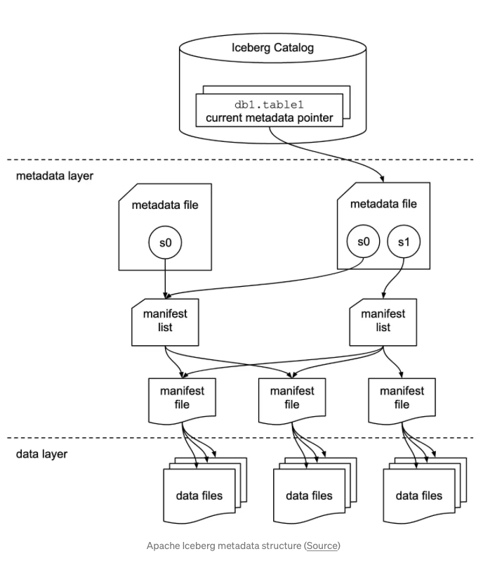
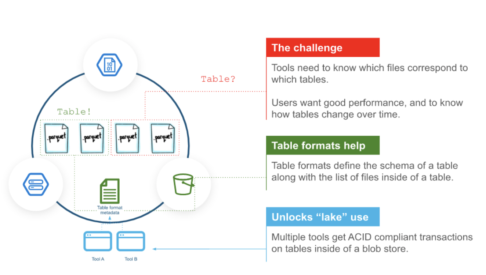
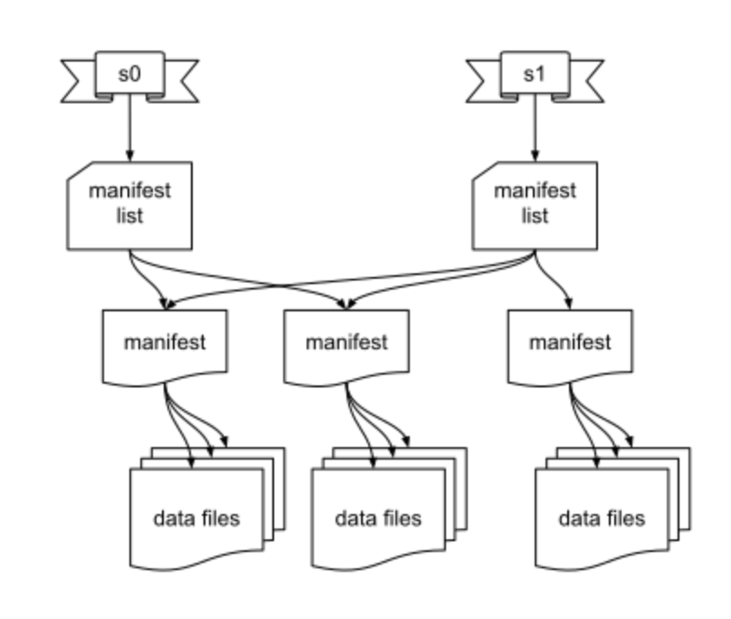
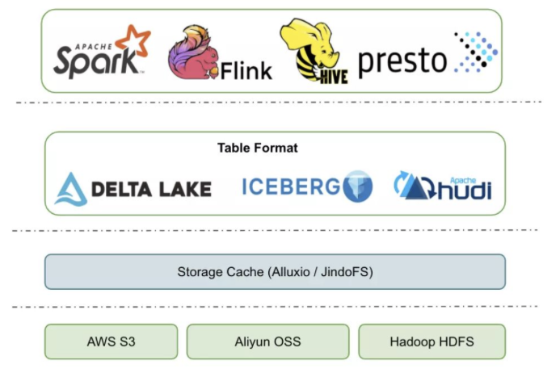

# Apache Iceberg

- The New generation data lake table format
- They enable cost-effective cloud

***
## 배경
- 기존 DataLake 구축을 위한 방법들은 "cloud native" 하지 않았음. 보통 on-prem Hadoop 기반.
- 그렇기에, data lake의 유지보수를 위한 프로젝트들이 많이 생겼지만 complexity를 증가시켰음
	-  [Waggle Dance](https://github.com/HotelsDotCom/waggle-dance), [Circus Train](https://github.com/HotelsDotCom/circus-train) and [Beekeeper](https://github.com/ExpediaGroup/beekeeper)
- 새로운 Data Lake Tech.들은 table formats을 통해서 현재 dataLake가 가지고 있던 문제들을 해결
	- [Apache Hudi](https://hudi.apache.org/), [Delta Lake](https://delta.io/) and [Apache Iceberg](http://iceberg.apache.org/)
	- cloud의 이점을 살리고 ACID 트랜잭션, time travel, point-in-time 쿼리, 파티셔닝

***
## Apache Iceberg 정의
- 거대한 테이블들을 관리하기 위한 Open Table Format 이다.
- DataLake 내 데이터를 쉽게 수정하고 삭제할 수 있는 오픈소스 데이터 프로세싱 프레임워크
	- *The function of a table format is to determine how you manage, **organise and track all of the files that make up a table**.*
	- 여러개의 DB / Tools 들에 대해 동일한 metastore, table format, 및 툴마다 다른 type에 대한 해결책을 제공
- Physical data (Parquet, ORC)와 테이블을 구성하고 있는 파일들 사이의 추상화 계층이라고 이해할 수 있다.
- 파일 추적 관리
	- 테이블을 구성하는 파일들을 추적 관리하고 구성한다.
	- cloud에서 사용하고 다양한 데이터 일관성 문제와 HIVE가 s3에서 가지고 있던 문제를 해결하기 위해 고안되었다.
	- Iceberg에서는 파일을 모두 Object/file 레벨로 관리하고 추적하기 때문에 빠르다.

<!-- {: width="30%" height="30%"} -->

1. Snapshot metadata file
	- table 의 메타데이터.(테이블 스키마), 파티셔닝 정보, manifest list 정보 포함
2. Manifest list
	- Manifest 파일 경로, data 파일 갯수, Manifest 파일 접근 권한 관리
3. Manifest file
	- 관련된 data file 리스트 , 경로, stats 정보 등 메타데이터
4. Data file
	- Parquet, ORC, Avro .. etc

***
## Apache Hive 단점 극복

**문제점**
- Apache Hive로매우 큰 데이터 세트를 작업으로 할 때 성능이 좋지않음
	-  Hive는 데이터를 folder레벨로 관리하기 때문에, 테이블에 있는 데이터를 찾기 위해 모두 탐색해야함
	- lack of grained metadata and relying on directory listing (O(N) complexity )
		-> Hive metastore / directory listing 은 데이터가 많아짐에 따라 bottleneck 유발
		
- 메타스토어와 데이터스토어가 분리되어 있어 원자성을 유지하기 힘듬
	- ex) insert중 메타 스토어 업데이트 오류 / 데이터 스토리지 저장 성공 시 정합성이 깨짐
	
- Apache Hive는 HDFS에 맞추어 설계되었기 때문에, Amazon S3 와 같은 다른 스토리지에 잘 결합되지 않는다.

***
## Iceberg 구조적 이점
- Snapshot 패턴을 이용하여 read / write 독립적으로 동작 가능 -> Atomically 
	- Readers는 Lock없이 일관된 데이터를 읽을 수 있다.
		Readers always consistent **snapshot** 
	- Writers는 독립적으로 실행되고 write가 모두 끝났을 때 Atomic 하게 commit이 가능
		Snapshot Lock
	- *optimistic concurrency control*
		사용자가 데이터를 동시에 수정하지 않을 것이라고 가정. 
		데이터를 읽을 때 Lock 설정 안함. 수정 시점에 값 변경 검사
- Snapshot 은 **time-travel** 이 가능
- 가장 큰 이점은 **performance benefits** 이다.
	- file pruning : 지정된 파일만 읽도록 하여 성능 최적화 가능케함
	- Predicate Pushdown : 파일시스템에서 데이터를 읽어온 이후 메모리에서 필터링하는 것이 아닌, 읽을 때부터 꼭 필요한 데이터만 효율적으로 읽음 -> 다양한 stats 데이터를 활용
-  Snapshot 방식을 사용하고, 테이블안에 메타정보를 같이 보관하여 파일 접근 속도를 O(1)로 가능케 한다.
	- 스냅샷 패턴과 metadata와 datastore를 같이 관리하기 때문에 Atomically하게 유지가 가능하다
	- 다른 2개의 시스템에서 롤백하는 것 보다(Hive) 더 용이한 rollback이 가능하다.
- 공통된 파일 포멧이기에 다양한 스토리지와 결합이 가능하다.

***
## Iceberg의 Reliability
1. Serializable isolation
	- 두 writers가 race condition에 놓일 경우, 하나의 wirter가 먼저 lock을 얻어 커밋 후 snapshot을 현재 버전으로 교체. 2번째 writer는 변경사항 적용 후 충돌 없을 시 커밋
	- 낙관적 동시성 제어 : 수정 시점에 값이 변경되었는지 반드시 검사
		- Git Flow 방식처럼 동작
	- !
	- Copy-On-Write 방식으로 Merge시 새 파일 생성 -> 버전관리에 용이
2. Reliable Read
	- Lock 없이 항상 일관된 결과를 얻을 수 있음
	- 항상 일관된 트리구조를 가진 Snapshot 을 가지기 때문
3. Version History and rollback
	- 히스토리 추적 및 롤백 가능
	- 메타 스토리지와 데이터 스토리지 별도 롤백 필요 없음
4. Safe file-level operation

***
## Iceberg 그 외 기능
빠른 쿼리를 위한 기능들을 제공함
1. Schema Evolution -> 테이블 변경없이 파티셔닝 변경
2. Hidden partitioning
3. Partition layout evolution
4. Time travel
5. **Query Engine Support**
	- Apache Spark와 잘맞음 (SparkSQL, SparkDataFrame)
	- StorageHandler를 이용하여 Hive를 이용해 Iceberg 테이블 조회 가능
		- `HiveIcebergStorageHandler`
		- *The storage handler is kept in sync (added or removed) every time Hive engine support for the table is updated*

***
## 예시 

***
출처

iceberg 정의
https://medium.com/expedia-group-tech/a-short-introduction-to-apache-iceberg-d34f628b6799

iceberg 파티셔닝
https://developer.ibm.com/articles/the-why-and-how-of-partitioning-in-apache-iceberg/

Iceberg를 써야하는 5가지 이유
https://www.snowflake.com/blog/5-reasons-apache-iceberg/?lang=ko

s3 cost 90% 축소
https://medium.com/insiderengineering/apache-iceberg-reduced-our-amazon-s3-cost-by-90-997cde5ce931

iceberg docs
https://iceberg.apache.org/docs/latest/hive/

Iceberg Reliability 
https://iceberg.apache.org/docs/latest/reliability/

Iceberg Concurrency Model
https://www.starburst.io/blog/trino-on-ice-iii-iceberg-concurrency-model-snapshots-and-the-iceberg-spec/

dataLake 기술 비교
https://www.dremio.com/subsurface/comparison-of-data-lake-table-formats-iceberg-hudi-and-delta-lake/