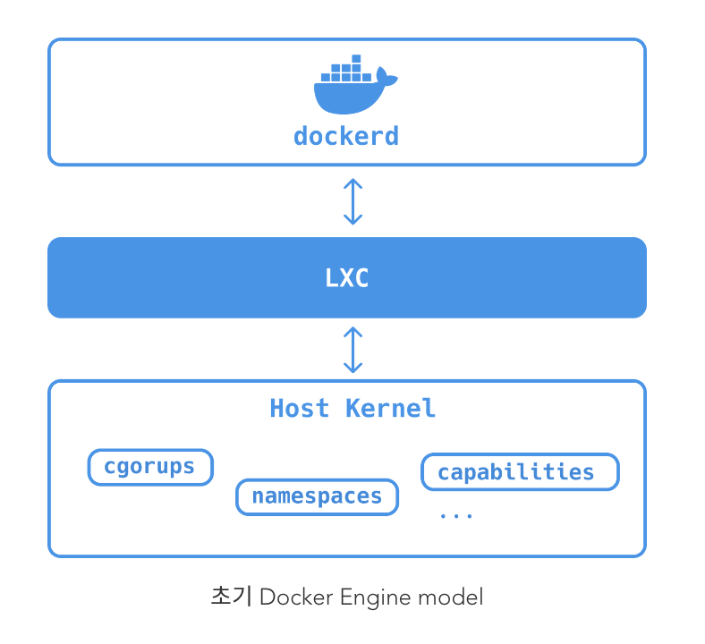
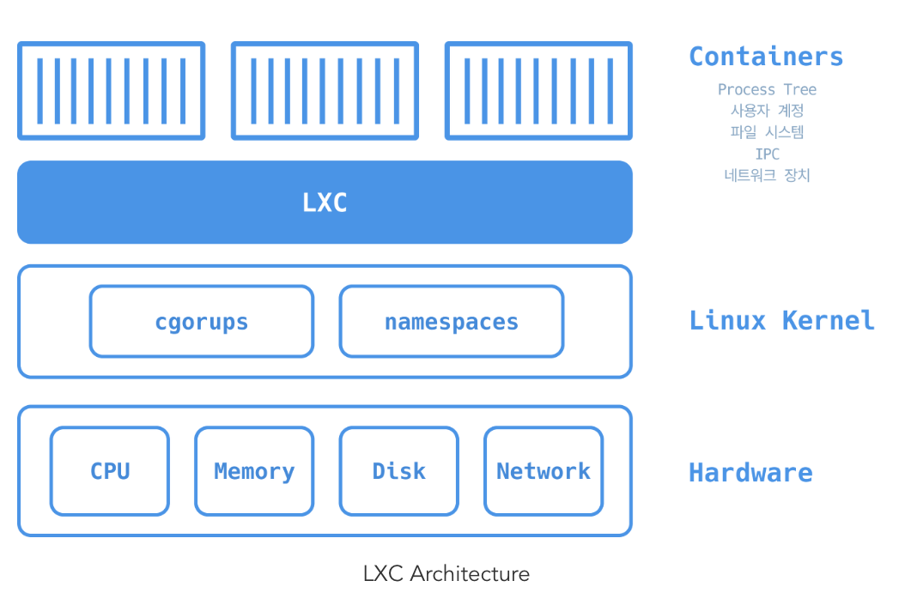
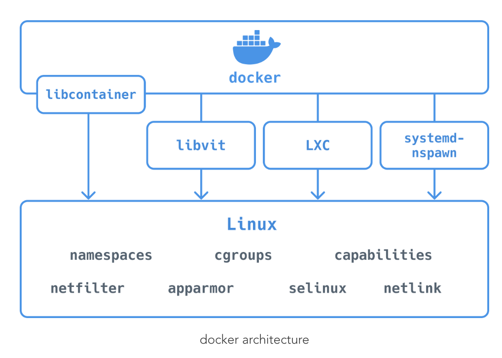
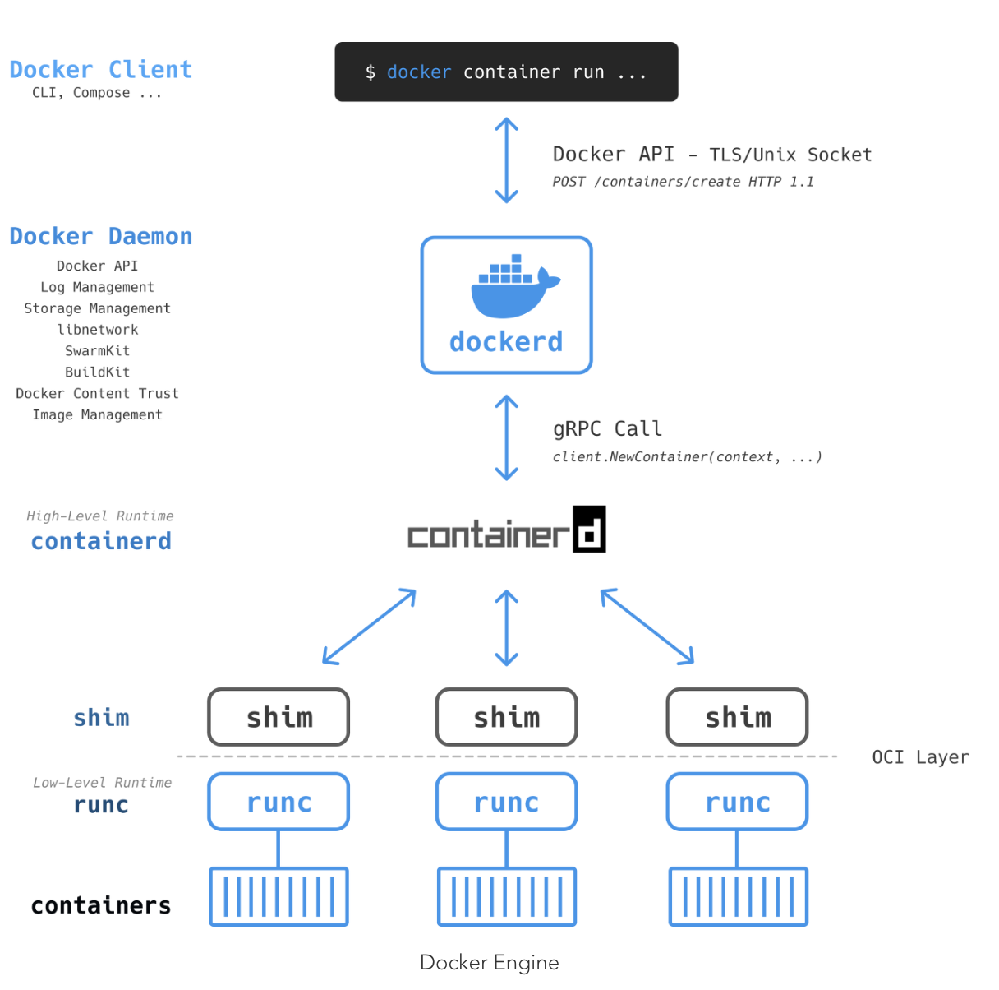
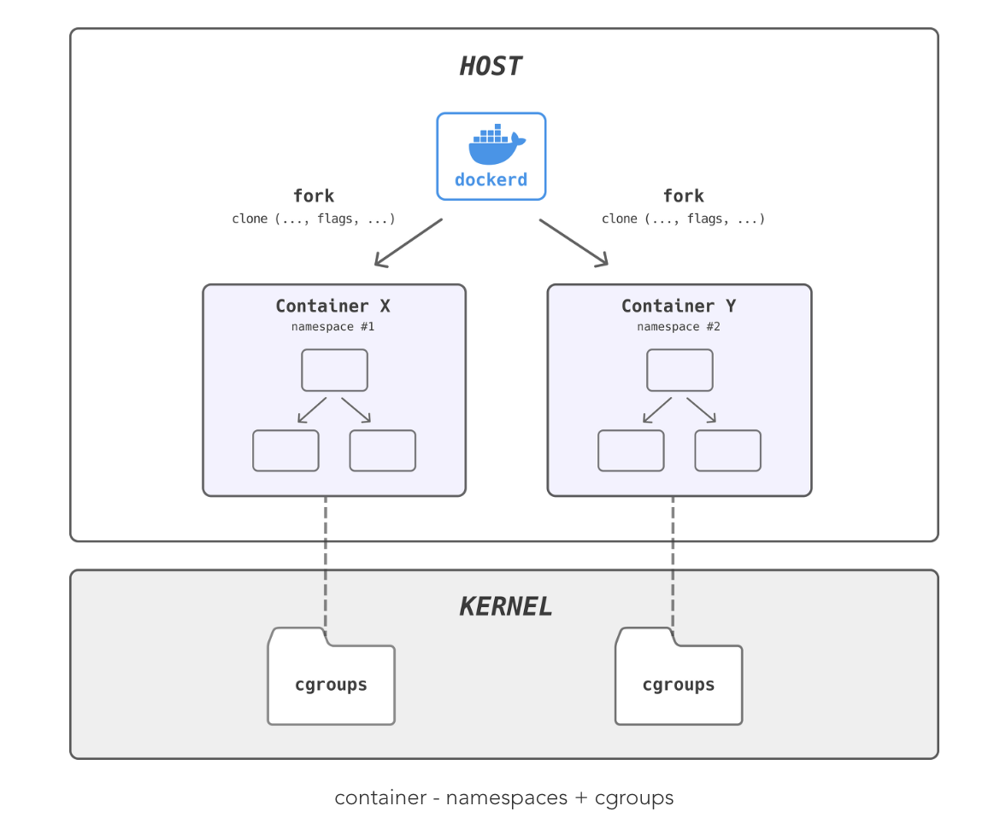

# Docker 구조

## 초기 Docker Engine
- Docker Daemon, LXC 로 구성


### Dockerd
- 도커 데몬은 모놀리 바이너리. (모듈화 x)
- Docker client, Docker API, Container Runtime, Image builds 등 포함

### LXC
- 여러개의 고립된 리눅스 시스템(컨테이너)들을 실행하기 위한 **운영 시스템 레벨 가상화 방법**
- 데몬에게 namespaces 나 cgroups와 같은 접근 제공


+ namespaces 
	- 운영 시스템을 쪼개서 고립된 상태로 운영
+ cgroups
	- 고립된 환경에서 사용할 자원 제한 (CPU, 메모리, IO 등등)

**문제점**
- LXC는 리눅스 특화 / 의존성 문제
- 해결을 위해 도커가 독자적으로 Libcontainer 툴 개발
- 기본 실행 드라이버를 LXC에서 libcontainer로 대체
***

## Libcontainer
- Docker Engine 에서 사용하고 있는 주 컴포넌트
- Go 언어로 만들어져 Container 생성 시 namespaces, cgroups, 등 제공
- Docker에서 자체적으로 제작한 libcontainer의 CLI wrapper `runc` 사용



# Docker Engine
- Client-Server 구조, **컨테이너를 구축하고 실행하는 기본 핵심 소프트웨어**
- Docker Daemon, REST API, API를 통해 도커 데몬과 통신하는 CLI 모듈식으로 구성



## 수행 순서
1) Docker client
- Docker CLI라고 이해 ```docker run / docker compose```
- Docker Client 는 사용자의 요청을 적절하게로 변환하여 **dockerd 에게 REST API POST 요청**

2) Dockerdc
- dockerd는 로컬 이미지가 있는지 확인 후 없으면 Registry Repository에서 가져옴
- 이미지 관리, 빌드, REST API, 인증, 보안, 네트워킹 등
- container를 생성하라는 명령을 수신하면 containerd 호출

3) Containerd
- High-Level Runtime
	- gRPC/Web API와 같이 컨테이너를 관리하는 것 이상의 높은 수준의 기능을 지원
- 실제로 containers를 생성하지 못하고 runc를 통해 생성
- 컨테이너 생명주기 관리 (+image pull 기능 확장)
- 실제로 컨테이너 생성 못하고 runc를 통해 OCI 번들로 생성

4) runc
- 내부 libcontainer는 OS 커널에 접속해 컨테이너를 만드는 데 필요한 구성요소를 묶어 **컨테이너 생성** (namespaces, cgroup 등)
- OCI(Open Container Initiative) 의 구현체
+ 커널의 컨테이너 기술 interface를 표준화 시킨 기술

5) shim
- 컨테이너 하위 프로세스인 runc가 종료되자 마자 docker-containered-shim이 상위 프로세스가 되어 생명주기 관리


# Container 기술 (namespaces, cgroups)
- 이전 Docker 사에서 Linux 의존성을 해결하기 위해 libcontainer를 제작
- 커널 서비스를 사용하여 시스템의 리소스(container API)들 직접 사용 가능
- namespace : 컨테이너 마다 독립된 공간을 제공
- cgroups : 분리된 자원 관리를 효율적으로 사용



- 출처 :https://gngsn.tistory.com/128


### 읽어볼 링크

**컨테이너의 역사**
https://naleejang.tistory.com/228

- OCI (Open Container Initiative) / CRI-O (Container Runtime Interface using OCI)
