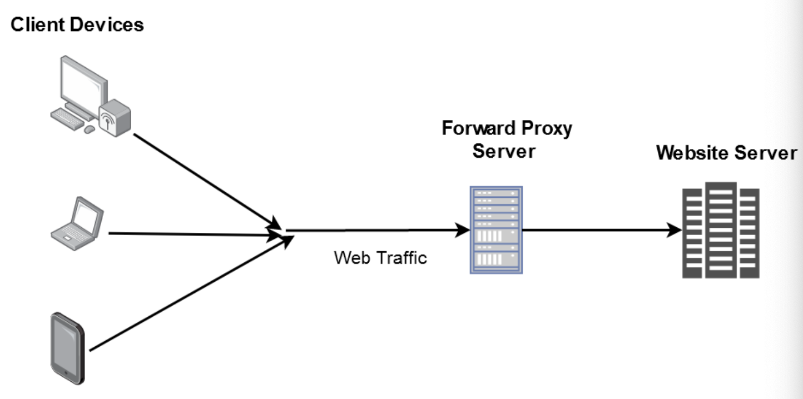
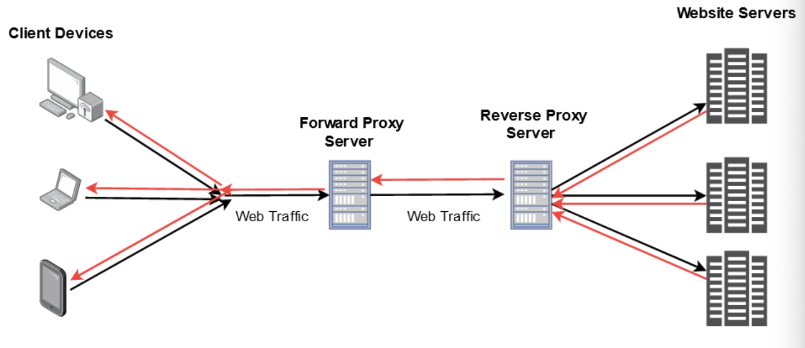

# Proxy Servers

생성일: 2022년 12월 11일 오후 7:32

### 3줄 요약

- 프록시 서버는 보안, 캐싱 기능을 제공함
- Forward 프록시 client side. client에 대한 정보를 숨기고, client의 접근 제한 가능
- Reverse 프록시 server side. server에 대한 정보 숨김.

### 비유

- You are the client
- Your order is the web request
- Waiter/Waitress is your forward proxy server
- Kitchen head chef is the reverse proxy server
- Other chefs working in the kitchen are the web servers

# Proxy Servers

***Every web request which is sent from the client to a web server goes through some type of proxy server.***

- 프록시 서버는 server와 client 간 gateway처럼 동작
- web request의 source IP를 proxy server의 IP 주소로 변환.
- 프록시 서버는 보안 강화를 더 쉽게 함.
- proxy server에 caching mechanism을 제공하여 퍼포먼스 증가.

## Forward Proxy Server

A forward proxy is generally implemented **on the client side** and **sits in front of multiple clients** or client sources.

- 보통 인터넷 사용을 제한하거나, 컨텐츠 제한을 위한 용도로 사용
    - ex) 학창시절 특정 웹페이지 차단 등.
- 방화벽을 사용하여 회사네트워크
- User가 익명으로 browse 가능함.

## Reverse Proxy Server

***Server Side***

It **sits in front of multiple webservers** and manages incoming requests by forwarding them to the web servers.

- backend 웹 서버에 대한 정보를 숨김.
    - 보통 웹서버의 인증, content 캐싱, 암호화 복호화에 사용.
- Load balancers 를 사용하여 트래픽 분산 처리

